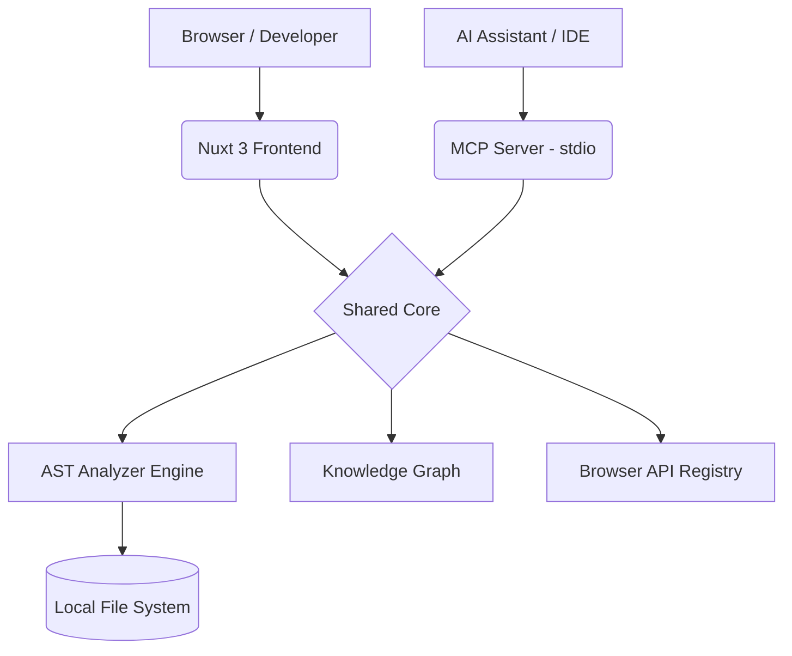

<div align="center">
  <h1>🔬 Frontend Performance Lab</h1>
  <p><strong>The Definitive Interactive Engineering Playground for Browser Internals & AI Assistance</strong></p>

  <p>
    <a href="https://github.com/smg99/frontend-performance-lab/actions"></a>
    <a href="#">94%25-brightgreen.svg?style=for-the-badge" alt="Coverage" /></a>
    <a href="./LICENSE"></a>
    <a href="#">=18.0.0-43853D?style=for-the-badge&logo=node.js&logoColor=white" alt="Node Version" /></a>
    <a href="https://nuxt.com/"></a>
    <a href="./mcp"></a>
  </p>
</div>

---

## 📖 Project Overview

### Why Frontend Performance Lab Exists
Modern frontend development is abstracted behind layers of frameworks. Developers often don't realize when they trigger forced synchronous layouts, memory leaks, or main-thread blocking operations until their Lighthouse score crashes. 

**Frontend Performance Lab** exists to demystify the browser rendering pipeline. It provides a visual, interactive sandbox paired with a professional-grade AST analyzer to catch performance bugs *before* they hit production.

### Who It Is For
- **Frontend Beginners:** Looking to visually understand foundational concepts (e.g., layout thrashing vs. paint flashing).
- **Mid/Senior Engineers:** Needing a sandbox to experiment with virtualized lists, web workers, and AST-based performance reviews.
- **AI Coding Assistants:** Leveraging the **Model Context Protocol (MCP)** to bring deep diagnostic knowledge directly into the IDE.

## 🌟 Try Online vs. Local Features

> **[Try Online (GitHub Pages) - Coming Soon](#)**  
> Note: The hosted version is purely documentation and interactive UI experiments. Due to security, the AST Analyzer and MCP server *must* be run locally.

### Feature Comparison

| Feature | Hosted (Web) | Local Clone | AI / MCP Server |
|---------|--------------|-------------|-----------------|
| Knowledge Graph & Recipes | ✅ Yes | ✅ Yes | ✅ Yes |
| Interactive UI Experiments | ✅ Yes | ✅ Yes | ❌ No |
| Cross-file AST Analysis | ❌ No | ✅ Yes | ✅ Yes |
| IDE Context & Fixes | ❌ No | ❌ No | ✅ Yes |

---

## 📸 Screenshots & Demos

*(Placeholders for production launch)*

> ****  
> *The professional Monaco-powered AST Analyzer Workspace.*

> ****  
> *Watch the CSS pipeline animate as the Analyzer processes your Vue and React components.*

> ****  
> *Discover all available AI tools and prompts natively in the MCP Hub.*

---

## 🏗️ Architecture



*The core logic is completely shared between the Nuxt UI and the MCP Server, meaning your AI sees exactly what the web dashboard sees.*

---

## ⚡ 5-Minute Quick Start

### 1. Installation

You will need Node `18.x` or higher.

```bash
# Clone the repository
git clone https://github.com/smg99/frontend-performance-lab.git

# Enter the directory
cd frontend-performance-lab

# Install dependencies
npm install
```

### 2. Start the Development Server

To explore the UI, experiments, and the visual Analyzer:

```bash
npm run dev
```
Open `http://localhost:3000` in your browser.

### 3. Analyze Your First Component in 2 Minutes

1. Navigate to **Quick Actions -> Analyze Code** in the web dashboard.
2. Drag and drop any `.vue`, `.jsx`, or `.js` file into the editor.
3. Press `Cmd + Enter` to run the analysis.
4. Watch the pipeline timeline flag layout thrashing, massive DOM rendering, or memory leaks!

---

## 🤖 Install MCP (AI Assistant Integration)

Bring the power of the Frontend Performance Lab directly into **Cursor, Claude Code, Windsurf, or VS Code**.

**[Read the Full MCP Setup Guide](./docs/mcp/getting-started.md)**

### Local MCP Setup (Quick)

The MCP server runs locally to ensure it has secure, instantaneous access to your AST and filesystem.

1. Ensure you have cloned the repo and run `npm install`.
2. Grab the absolute path to your cloned repository.
3. Configure your IDE. For example, in **Cursor**, add a new MCP Server:
   - **Type:** `command`
   - **Command:** `npx tsx /absolute/path/to/frontend-performance-lab/mcp/server.ts`

### Supported IDEs
- **Cursor**
- **Claude Code CLI**
- **VS Code (via Cline/Roo)**
- **Windsurf**
- **Continue.dev**
- **Gemini CLI**

---

## 📜 Commands Reference

| Command | Description |
|---------|-------------|
| `npm run dev` | Starts the Nuxt 3 frontend development server. |
| `npm run mcp:start` | Runs the MCP server in `stdio` mode for IDEs. |
| `npm run validate:analyzer` | Runs the Vitest regression suite and updates `ANALYZER_COVERAGE.md`. |
| `npm run test` | Runs the standard unit tests. |
| `npm run build` | Builds the Nuxt application for production. |
| `npm run lint` | Runs ESLint and Prettier formatting. |

---

## 📂 Repository Structure

- `/app` - Nuxt 3 pages, UI components, and the glassmorphic Design System.
- `/shared` - The framework-agnostic core logic, AST Analyzer (`shared/utils/analyzer`), and schemas.
- `/mcp` - The Model Context Protocol server exposing the shared core to AI.
- `/docs` - Extensive documentation and troubleshooting.
- `/scripts` - Validation and coverage automation.

---

## 🚀 Release Philosophy & Performance Goals

This is treated as a commercial-grade SaaS product, not just a demo.
- **Maintainability over speed:** Clean architecture and zero-duplication between MCP and UI.
- **Strict TDD:** Every bug fix in the AST analyzer must first be a regression test.
- **Performance SLA:** The analyzer guarantees execution in < 500ms for files up to 5,000 LOC.

---

## 🗺️ Roadmap

- **Phase 1 (Complete):** UI Design System, Core AST MVP, and MCP Hub.
- **Phase 2 (In Progress):** Cross-file ProjectGraph AST analysis (allowing variable tracing across imports).
- **Phase 3 (Coming Soon):** Visual Dependency Graphs and Performance Budget Gauges.
- **Hosted MCP (Future):** Support for `SSE` (Server-Sent Events) for remote AI clients.

## ❓ FAQ

**Q: Why does the analyzer flag my `.map()` in React as an issue?**  
A: By default, the `react-large-map` rule flags arrays mapped directly to JSX without virtualization. Use `react-window` for large lists to protect DOM layout times.

**Q: Why do I need to run this locally?**  
A: The AST Analyzer requires read-access to your local files to scan for bugs. Browser security prevents a hosted web-app from accessing your local directory structure effortlessly.

**Q: I have an issue connecting my IDE to the MCP server.**  
A: Please check our [Troubleshooting Guide](./docs/troubleshooting.md).

---

## 🤝 Contributing

We welcome contributions! Please follow our testing policy:
- No commits without matching regression tests.
- Verify `npm run validate:analyzer` passes.
- Adhere to the glassmorphic Tailwind design system.

## 📜 License & Credits

MIT License. Created to push the boundaries of AI-assisted frontend engineering.
