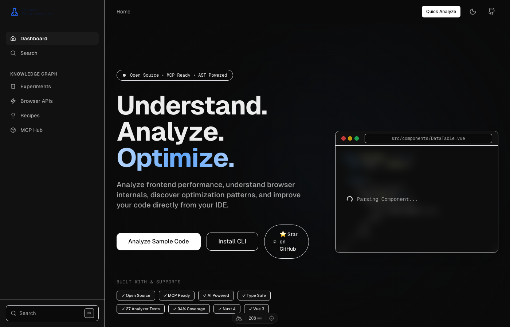
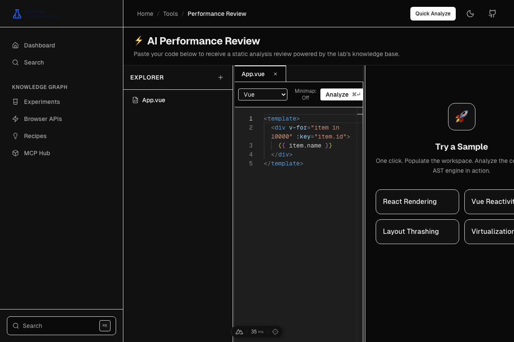
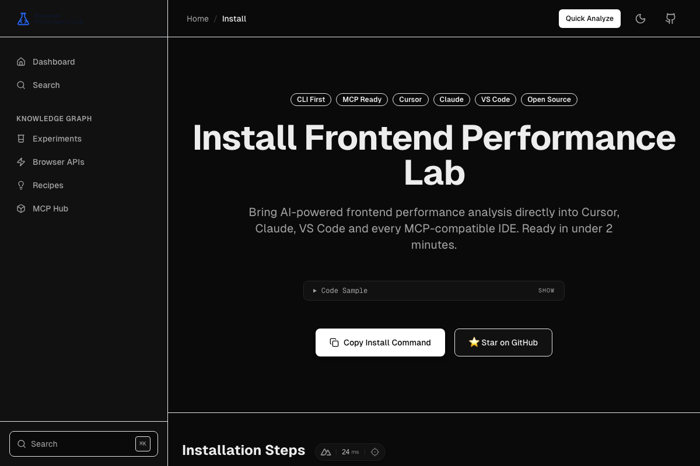
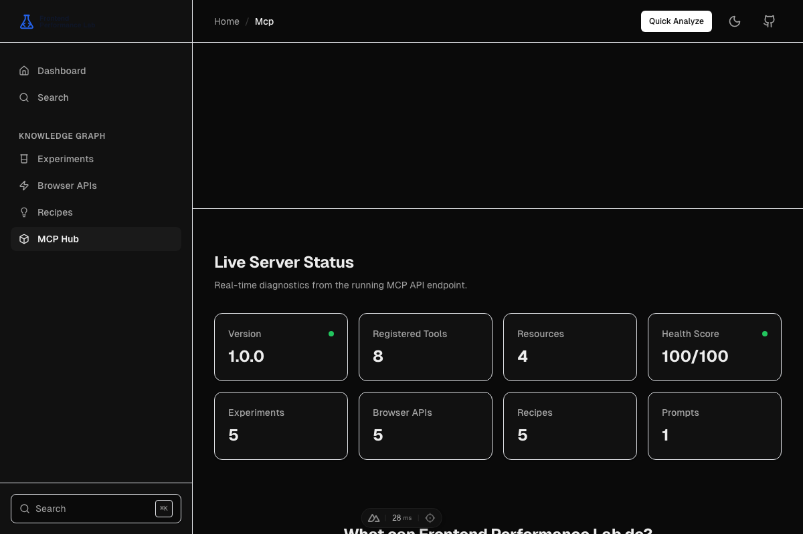
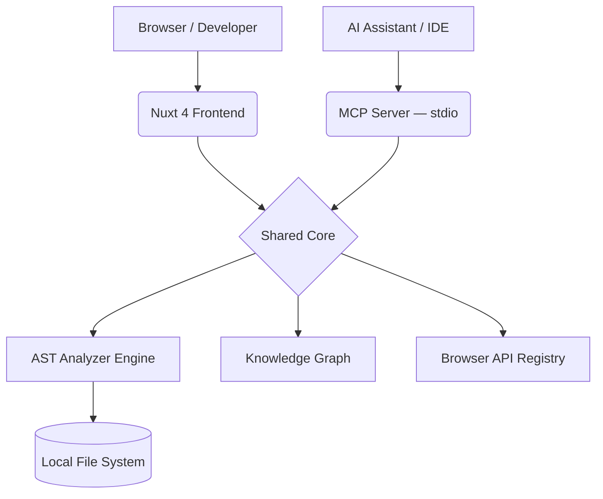

<div align="center">
  <br/>
  <a href="https://smg99.github.io/frontend-performance-lab" target="_blank">
    <picture>
      <source media="(prefers-color-scheme: dark)" srcset="./public/branding/logo-dark.svg">
      <source media="(prefers-color-scheme: light)" srcset="./public/branding/logo-light.svg">
      
    </picture>
  </a>
  <br/><br/>

  <p>
    <b>The AI-powered performance engine for modern frontend teams.</b><br/>
    Catch layout thrashing, memory leaks, and render explosions before they reach production.
  </p>

  <p>
    <a href="https://github.com/smg99/frontend-performance-lab/actions"></a>
    <a href="./ANALYZER_COVERAGE.md">94%25-22c55e?style=flat-square" alt="Coverage"></a>
    <a href="./mcp"></a>
    
    
  </p>

  <p>
    <a href="#quick-start"><b>Quick Start</b></a> •
    <a href="#why-frontend-performance-lab"><b>Why FPL?</b></a> •
    <a href="#features"><b>Features</b></a> •
    <a href="#architecture"><b>Architecture</b></a> •
    <a href="./CONTRIBUTING.md"><b>Contributing</b></a>
  </p>

  <br/>
  <a href="https://frontend-performance-lab.dev">
    
  </a>
</div>

---

## ⚡ Quick Start

Get up and running with the CLI and MCP server in under two minutes:

```bash
# 1. Install the CLI globally
npm install -g @smg99/frontend-performance-lab-cli

# 2. Configure your IDE (Cursor, Claude, VS Code, Windsurf)
fpl setup

# 3. Verify installation
fpl doctor
```

Restart your IDE and you're ready to go!

### What happens during setup?

- ✓ Installs the `@smg99/frontend-performance-lab-cli` globally
- ✓ Detects your active IDE (Cursor, Claude Desktop, Windsurf, etc.)
- ✓ Configures the MCP server automatically in your IDE settings
- ✓ Verifies the connection and dependencies with `fpl doctor`
- ✓ Ready to use immediately to analyze your components

---

## 🤔 Why Frontend Performance Lab?

Traditional AI assistants understand code.
**Frontend Performance Lab understands frontend performance.**

Modern frameworks like React and Vue are fast by default — until they aren't. A single deep array watcher or a forced synchronous layout can crash your Lighthouse score and ruin the user experience.

Frontend Performance Lab provides your AI assistant (via **MCP**) with a massive, specialized knowledge graph dedicated entirely to making browsers render frames faster and consume less memory.

### Built For:

- **Vue, React, Nuxt, Next.js, Angular**
- **Cursor, Claude Desktop, VS Code, Windsurf**

---

## ✨ Features

### 🔬 AST Performance Analyzer

Drop in any `.vue`, `.jsx`, or `.js` file. The engine uses Babel AST traversal to instantly detect layout thrashing, event listener leaks, massive render trees, and reactivity pitfalls.

### 🤖 MCP Integration

The full knowledge base — experiments, recipes, browser APIs — exposed directly to your AI assistant. Ask Cursor or Claude to "optimize this component using Frontend Performance Lab" and watch the magic happen.

### 🧪 Interactive Experiments

Live Vue and React components you can tweak in real time. See what happens to frame rates when you skip virtualization on a 10,000-row list, or trigger a forced synchronous layout.

### 📖 Recipes & Browser APIs

Structured tutorials mapped directly to the analyzer's findings. Fix what the analyzer catches with step-by-step implementation guides.

---

## 📸 See it in Action

<table align="center" style="width: 100%;">
  <tr>
    <td colspan="2" align="center">
      <b>Analyzer Workspace</b><br>
      
    </td>
  </tr>
  <tr>
    <td align="center" width="50%">
      <b>Install Wizard</b><br>
      
    </td>
    <td align="center" width="50%">
      <b>MCP Playground</b><br>
      
    </td>
  </tr>
</table>

---

## 🏗 Architecture

At its core, Frontend Performance Lab is powered by a unified Node.js engine shared seamlessly between the Nuxt 4 web dashboard and the stdio MCP server.



_Your AI sees exactly what the dashboard sees._

---

## 🤝 Contributing

We welcome contributions! Whether you want to add a new performance recipe, write an AST rule, or improve the UI, we'd love your help.

Read our **[Contributing Guide](./CONTRIBUTING.md)** to get started with local development.

---

<div align="center">
  <p>Built with ❤️ by performance enthusiasts.</p>
  <a href="https://frontend-performance-lab.dev">Visit the Website</a>
</div>
# Releases

New npm releases are created automatically by pushing a version tag.

```bash
git tag v1.0.0-beta.2
git push origin v1.0.0-beta.2
```

The `publish.yml` workflow will publish the CLI to npm using npm Trusted Publisher (OIDC) and create a GitHub Release with autogenerated notes.
