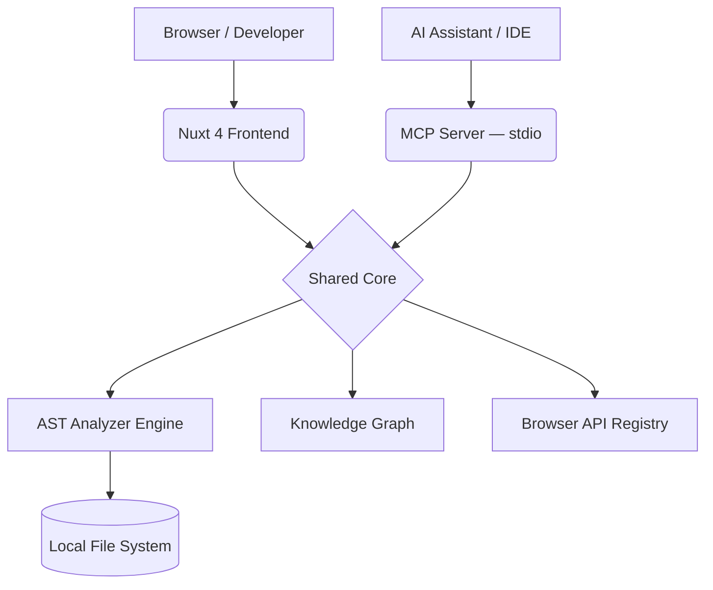

<div align="center">
<br/>
<picture>
  <source media="(prefers-color-scheme: dark)" srcset="./public/branding/logo-dark.svg">
  <source media="(prefers-color-scheme: light)" srcset="./public/branding/logo-light.svg">
  
</picture>
<br/><br/>

# Frontend Performance Lab

**Write faster Vue & React. Stop shipping slow code.**

A live playground, AST analyzer, and AI knowledge base that catches  
layout thrashing, memory leaks, and render explosions — before they reach production.

<br/>

[](https://github.com/smg99/frontend-performance-lab/actions)
[](./ANALYZER_COVERAGE.md)
[](https://nuxt.com)
[](https://vuejs.org)
[](https://www.typescriptlang.org)
[](./mcp)
[](./LICENSE)
[](https://smg99.github.io/frontend-performance-lab)

</div>

---

## Why This Exists

Modern frameworks are fast by default — until they aren't.

Layout thrashing. Massive re-render loops. Memory leaks from forgotten event listeners. These bugs are invisible until a Lighthouse score crashes or a user complains.

**Frontend Performance Lab** puts performance patterns front-and-center: interactive experiments you can break, an AST analyzer that reads your actual code, and an MCP server that brings the whole knowledge base into your AI coding assistant.

**Built for:**

- **Engineers learning the browser** — visualize the render pipeline, not just read about it
- **Mid/senior developers** — experiment with virtualization, Web Workers, and reactivity edge cases in a safe sandbox
- **AI coding assistants** — query the knowledge base via MCP, directly inside Cursor, Claude Code, or VS Code

---

## What's Inside

### ⚡ AST Performance Analyzer

Drop in any `.vue`, `.jsx`, or `.js` file. Get instant, line-level feedback on layout thrashing, event listener leaks, and large render trees — powered by Babel AST traversal.

### 🧪 Interactive Experiments

Live Vue components you can tweak in real time. See what happens to frame rate when you skip virtualization on a 10,000-row list, or trigger a forced synchronous layout.

### 🤖 MCP Integration

The full knowledge base — experiments, recipes, browser APIs — exposed as MCP tools and resources. Your AI assistant sees exactly what the dashboard sees.

### 📖 Recipes & Browser APIs

Structured tutorials mapped directly to the analyzer's findings. Fix what the analyzer catches with step-by-step implementation guides.

---

## Get Started

The easiest way to get started is by using the official CLI.

```bash
npx @frontend-performance-lab/cli setup
```

This will run the onboarding wizard, check your environment, and configure your IDE automatically.

Alternatively, install it globally:

```bash
npm install -g @frontend-performance-lab/cli
fpl setup
fpl doctor
```

---

## Connect to Your AI Assistant

The CLI comes with an embedded MCP server that exposes the entire knowledge graph to your IDE.
If you ran `fpl setup`, this might already be configured for you!

If you prefer manual setup, add this to your IDE config (example: **Cursor**):

```json
{
  "mcpServers": {
    "frontend-performance-lab": {
      "command": "npx",
      "args": ["-y", "@frontend-performance-lab/cli", "mcp"]
    }
  }
}
```

**[Migration Guide for older versions →](./docs/MIGRATION.md)**

Supported: **Cursor · Claude Code · VS Code (Cline/Roo) · Windsurf · Continue.dev · Gemini CLI**

---

## Architecture



_The analyzer engine is fully shared between the UI and the MCP server — your AI sees exactly what the dashboard sees._

---

## Commands

| Command                     | Description                  |
| --------------------------- | ---------------------------- |
| `npm run dev`               | Start the Nuxt 4 dev server  |
| `npm run mcp:start`         | Run the MCP server (stdio)   |
| `npm run validate:analyzer` | Run the AST regression suite |
| `npm run test`              | Run unit tests               |
| `npm run build`             | Build for production         |
| `npm run lint`              | Lint & format                |

---

## Roadmap

- ✅ **Phase 1** — Design system, core AST engine, MCP Hub
- 🔄 **Phase 2** — Cross-file ProjectGraph analysis _(in progress)_
- 📋 **Phase 3** — Visual dependency graphs, performance budget gauges
- 🌐 **Future** — Hosted MCP via SSE for remote AI clients

---

## Contributing

To contribute to the core analyzer rules, MCP server, or documentation, you will need to clone the repository:

```bash
git clone https://github.com/smg99/frontend-performance-lab.git
cd frontend-performance-lab
npm install
npm run dev
```

No commit without a regression test. Run `npm run validate:analyzer` before opening a PR.

**[Contributing Guide →](./CONTRIBUTING.md)** · **[MIT License](./LICENSE)**
