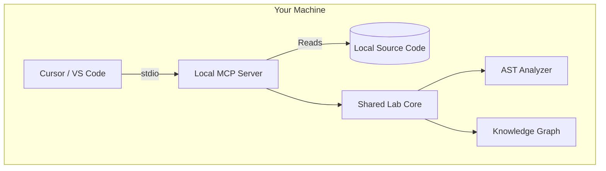
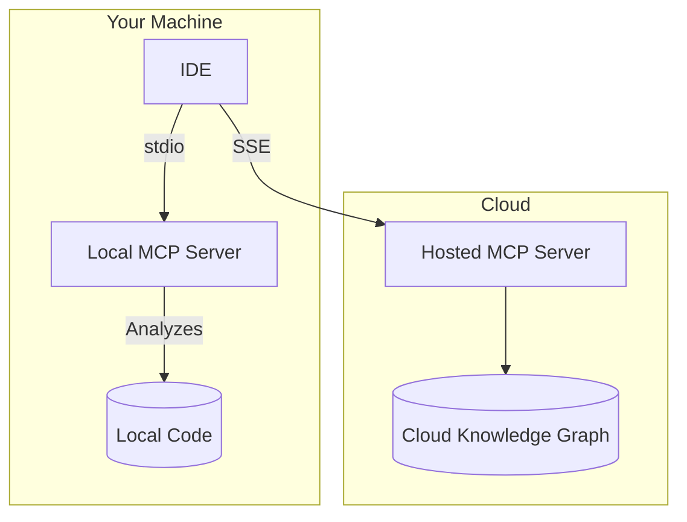

# Local vs Hosted MCP Architecture

This document outlines the architectural boundaries of the Frontend Performance Lab, explaining why certain features must run locally on your machine, and what the roadmap looks like for cloud-hosted implementations.

---

## 1. Local MCP Architecture (Current)

Currently, the Frontend Performance Lab operates exclusively in a **Local Mode**.

### Why run locally?

The core value of the Lab is the **AST Analyzer** (`shared/utils/analyzer`). To identify layout thrashing, memory leaks, and unoptimized virtual loops, the analyzer must:

1. Access your file system to read your source code.
2. Resolve local paths.
3. Run intensive parsing (via Babel or Vue compilers) that would be slow over a network.

Because browsers explicitly prevent web applications from securely accessing your local hard drive, a hosted website (like GitHub Pages or Vercel) **cannot** run the analyzer against your private code automatically.

By running the MCP server locally via `stdio`, your IDE (Cursor, Claude Code, etc.) communicates securely and instantly with the analyzer engine.

### Mermaid Diagram: Local Architecture

---

## 2. Hosted MCP Architecture (Coming Soon)

In the future, we plan to deploy a **Hosted MCP** endpoint.

### What it will support

- **Knowledge Graph Access:** Instantly ask your AI for recipes and browser API definitions without installing the lab locally.
- **Protocol:** It will use `SSE` (Server-Sent Events) over HTTPS instead of local `stdio`.

### What it will NOT support

- **AST Analyzer:** For security and privacy, we will not send your proprietary source code to our servers for analysis.

### Why GitHub Pages cannot host the MCP server

GitHub Pages is a static file host. The MCP Server requires an active Node.js runtime process to handle JSON-RPC messaging (either via `stdio` or active HTTP/SSE connections). Therefore, the hosted solution will likely be deployed on a platform like Vercel or Railway.

---

## 3. Hybrid Architecture (Future Roadmap)

The ultimate vision is a **Hybrid Architecture** that seamlessly blends the two modes.

In a hybrid world, your AI assistant will route code-analysis requests to the local stdio server, while simultaneously querying the hosted server for the latest, continually-updated community performance recipes and experiments.
